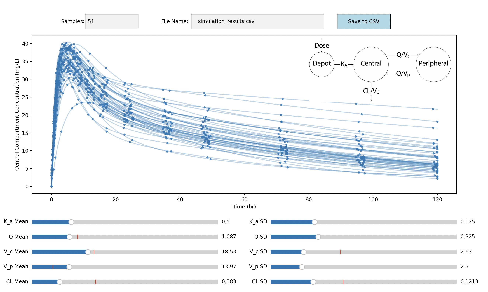

# GraphPKSim

A simple simulation widget for a two-compartment pharmacokinetic (PK) model, exploring graph-theoretic representations of the system.

## Graph theoretic representation

We can represent the PK model as a weigthed directed graph, $\mathcal(D)$, with edges between compartments that have transport and weights defined by the kinetic rate constant for the transport between compartments. 

The graph laplacian can be computed as the difference of the degree matrix and the adjacency matrix

$$
L \left( \mathcal{D} \right) = \Delta\left( \mathcal{D} \right) - A\left(\mathcal{D}\right)
$$

This matrix represents the flow through the system (out of each node). We can use this matrix to write the system of differential equations that describe the PK concentrations $c(t)$ with an initial dose of $D_0$:

$$
\dot{c}(t) = -L^T \left(\mathcal{D} \right) c(t) + D_0
$$
